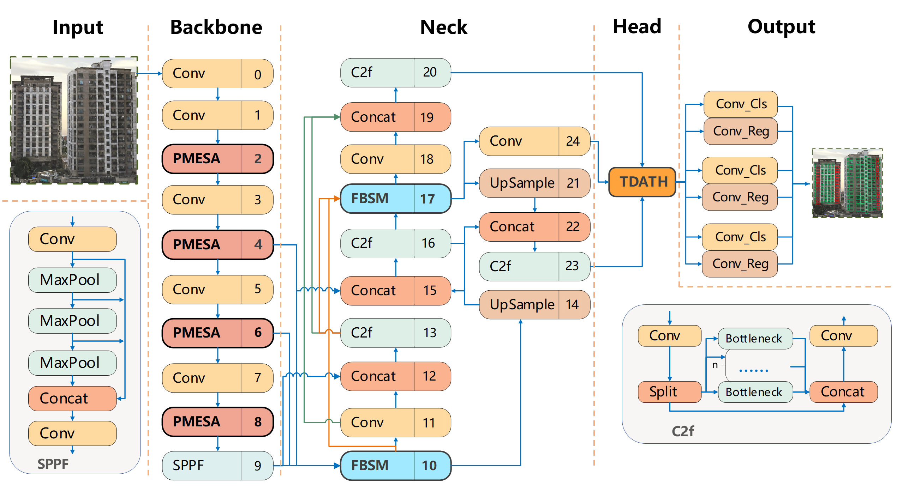

# BFA-YOLO: A balanced multiscale object detection network for building façade attachments detection
[PDF](https://arxiv.org/pdf/2409.04025)


The detection of façade elements on buildings, such as doors, windows, balconies, air conditioning units, billboards, and glass curtain walls, is a critical step in automating the creation of Building Information Modeling (BIM). Yet, this field faces significant challenges, including the uneven distribution of façade elements, the presence of small objects, and substantial background noise, which hamper detection accuracy. To address these issues, we develop the BFA-YOLO model and the BFA-3D dataset in this study. The BFA-YOLO model is an advanced architecture designed specifically for analyzing multi-view images of façade attachments. It integrates three novel components: the Feature Balanced Spindle Module (FBSM) that tackles the issue of uneven object distribution; the Target Dynamic Alignment Task Detection Head (TDATH) that enhances the detection of small objects; and the Position Memory Enhanced Self-Attention Mechanism (PMESA), aimed at reducing the impact of background noise. These elements collectively enable BFA-YOLO to effectively address each challenge, thereby improving model robustness and detection precision. The BFA-3D dataset, offers multi-view images with precise annotations across a wide range of façade attachment categories. This dataset is developed to address the limitations present in existing façade detection datasets, which often feature a single perspective and insufficient category coverage. Through comparative analysis, BFA-YOLO demonstrated improvements of 1.8\% and 2.9\% in mAP50 on the BFA-3D dataset and the public Façade-WHU dataset, respectively, when compared to the baseline YOLOv8 model. These results highlight the superior performance of BFA-YOLO in façade element detection and the advancement of intelligent BIM technologies.


## Model Structure


## Data Preparation
[Download](https://pan.baidu.com/s/1BXiSJ4Ud_IcQ5Z2sgEYcBw?pwd=rysy)


## Training
```
python train.py
```


## Publication
If you want to use this work, please consider citing the following paper.
```
@article{chen2025bfa,
  title={BFA-YOLO: A balanced multiscale object detection network for building fa{\c{c}}ade elements detection},
  author={Chen, Yangguang and Wang, Tong and Chen, Guanzhou and Zhu, Kun and Tan, Xiaoliang and Wang, Jiaqi and Guo, Wenchao and Wang, Qing and Luo, Xiaolong and Zhang, Xiaodong},
  journal={Advanced Engineering Informatics},
  volume={65},
  pages={103289},
  year={2025},
  publisher={Elsevier}
}
```
